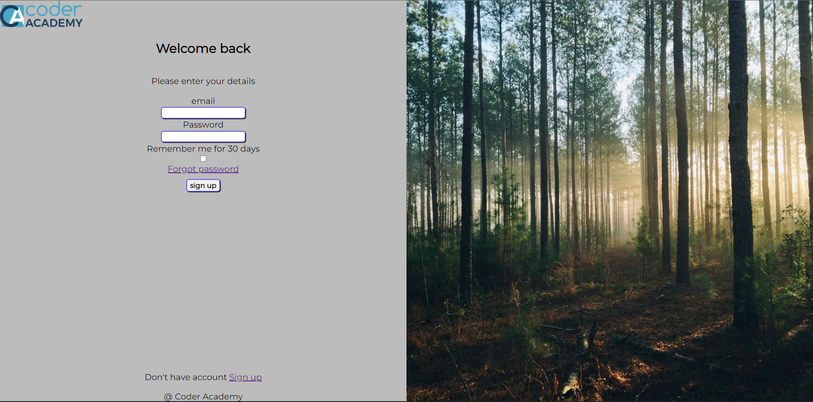
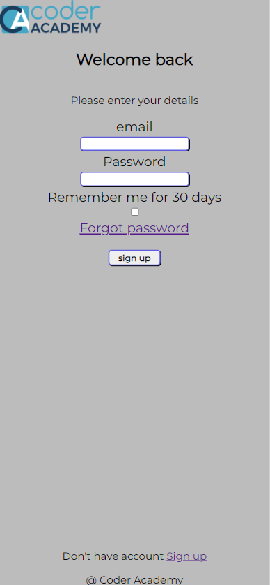
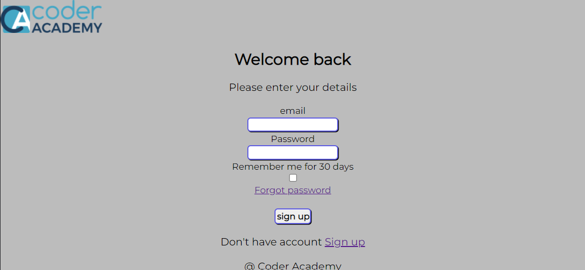

# Signup-form

This is a basic sign up page made using html and css.  
The sign up page was made during class with coder academy  
and inspiration was taken from [dribble log in page - Jordan Hughes](https://dribbble.com/shots/18890725-Log-in-page-Untitled-UI).  

### __Hurdles__
Working on this project introduced the use of media tags in css and  
layout complications. Doing this has given myself a stronger understanding  
in flexbox and view heights/widths.

### __screenshots__

Desktop layout.  

  
Phone portrait.

  
Phone landscape.